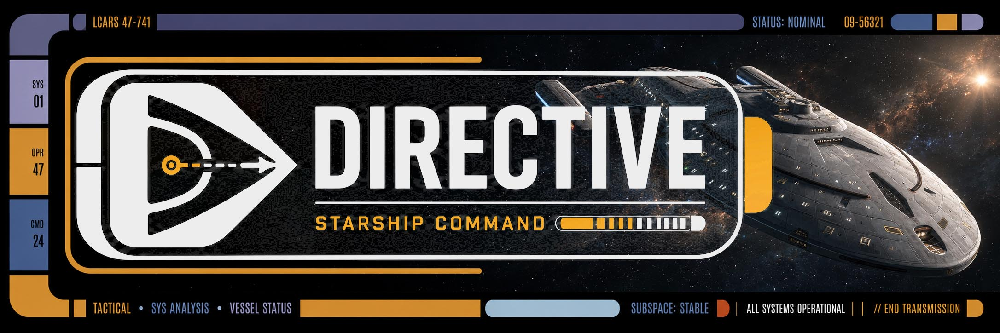

# Directive for Sonder Engine

  

Directive is a native Sonder Engine extension for command-centered Star Trek-style roleplay.
The current migration target is a single native runtime:

The extension provisions a complete playable `Ashes of Peace` story as one atomic Sonder story.
That includes the player commission, captain and senior staff, opening continuity, and
campaign rules in one operation.

## What you can play today

`Ashes of Peace` is the only live campaign.
Other campaign names may exist as previews only.

## Fast start

1. Install this extension in your host using your normal Sonder extension flow.
2. Open a story and click the Directive top-bar button (`⌁`).
3. On Campaign, fill the commissioning form and complete all steps.
4. Choose your simulation mode.
5. Click **Start Campaign** to create the active story atomically.
6. Continue with normal prose gameplay in the host chat.

## Main screens

Campaign shows setup, continuation state, and save controls that are available in your host.
Mission shows current objectives, outcomes, and known facts.
People shows public personnel records and contact history.
Ship shows operational cohesion, assignment status, and systems.
Settings shows campaign authority, provider ownership, and storage health.

## Alpha expectations

This is an active Alpha.
The migration is stable for core play, but several backend-facing features are still being finished.
Expect occasional edge cases and release-to-release shifts.

## What not to expect (yet)

This is a migration from the old SillyTavern runtime.
Directive does not run inside SillyTavern and does not keep the old save system.
There is no SillyTavern preset requirement inside Directive itself.
Campaign save/load/delete and branch management are owned by your active Sonder host and still being finalized.

## Documentation

Start with [the documentation index](docs/DOCUMENTATION_INDEX.md) before your first campaign run.

## Source and references

- [Migration status](docs/MIGRATION_STATUS.md)
- [Architecture summary](docs/ARCHITECTURE.md)
- [Responsibility matrix](docs/MIGRATION_RESPONSIBILITY_MATRIX.md)
- [Migration evidence and proofs](docs/superpowers/plans)

