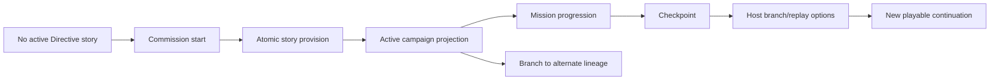

# Campaigns and Story Lifecycle

## Lifecycle at a glance

## From launch to continuation

After commissioning, Directive binds a complete playable story as the active chat.
If you continue that chat, you remain in the same lineage.

If you open from host continuation tools:

- the projection is fetched by chat id
- the authoritative state is reconstructed from host lineage
- projection only shows player-safe public facts

## Checkpoint behavior

Checkpoint is a snapshot marker.
It preserves a stable snapshot for rollback workflows.

Loading from a checkpoint:

- starts a cloned continuation
- does not destroy your previous save
- keeps your timeline consistent with the chosen lineage

## Branch and reroll behavior

Reroll and branch are host-owned actions.
They:

- use the committed turn boundary
- preserve Directive frame and document state with the branch
- refresh host-visible continuation in a separate branch state

## Save, delete, and management state

The native campaign lifecycle management (save/delete naming flows and some library actions) is in host finalization.
In this migration build, those actions may appear limited.

## Export/import behavior

Campaign export/import is supported through host facilities when available.
Use only verified exports with matching campaign package versions.

