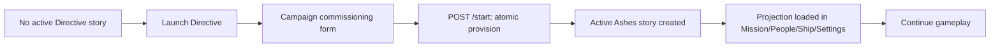

# Installing Directive and First Launch

Directive is installed through your host’s normal extension path.

## One-time setup

Install the extension once and restart your host if your host requires a reload.

Then in a live story view:

1. Open the host story view.
2. Click the Directive top-bar launcher (the LCARS icon in the launcher rail).
3. Wait for the Campaign route to open.
4. Fill in your commission form:
   - identity details
   - service and background
   - command traits
   - final review
5. Select your simulation mode.
6. Click **Start Campaign**.

If setup succeeds, Directive returns the new story chat id and opens that story.

## First launch flow

## What you should not expect in this step

- No extra migration step is required after startup.
- No preset installation is required inside Directive.
- If a required field is missing, setup pauses and shows a clear message.

If commissioning fails, try:

- re-opening the launcher
- reloading the host
- checking whether your host can create new stories
- retrying launch from the same launcher
