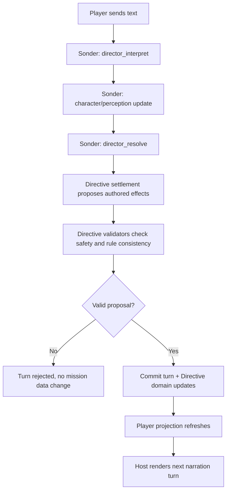

# How Turns, Drafts, and Story Controls Work

Directive on Sonder uses committed-turn gameplay.
Your visible story response is authoritative only after the host commit sequence runs.

## Turn flow

If a proposal is invalid, Directive does not invent a new state.
The player keeps control of the next message as usual.

## Draft and acceptance model

Directive does not create a separate acceptance file or second timeline.
The host may still show message candidates and variants.
Your next accepted player message selects what is kept in the story.

## Branch and replay controls

Branching, rerolls, and replay controls are host-native in this migration.
Use the host controls and verify you are on the active campaign story before replaying.

